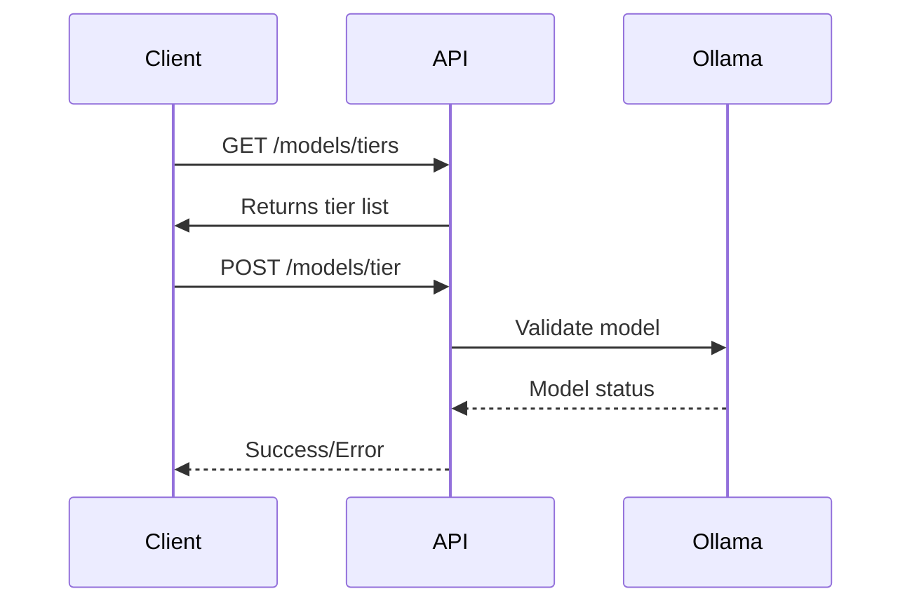
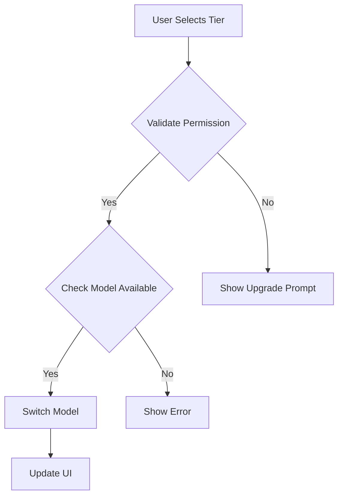

# Model Switching Integration Plan

## 1. Current State Analysis

### Existing Components
- Backend model profile management in `profiles.js`
- Frontend API integration for profile management
- Settings panel UI foundation
- Ollama API integration

### Key Files to Modify
- `backend/src/config/profiles.js`
- `frontend/api.js`
- `frontend/index.html`
- `backend/src/server.js`

## 2. Implementation Plan

### Phase 1: Backend Enhancements

#### Model Profile Schema Update
```javascript
{
  displayName: "Standard",  // User-facing name
  internalName: "KYNSEY Mini",  // Internal reference
  modelId: "llama3.2:3b-instruct-fp16",
  description: "Fast and efficient for everyday tasks",
  tier: "standard"  // standard, pro, code
}
```

#### New API Endpoints
- `GET /api/models/tiers` - Get available model tiers
- `POST /api/models/tier` - Switch active model tier
- `GET /api/models/status` - Check model availability



### Phase 2: Frontend Updates

#### UI Components
1. Model Tier Selector
```html
<div class="model-tier-selector">
  <label>Model Tier</label>
  <select id="modelTierSelect">
    <option value="standard">Standard</option>
    <option value="pro">Pro</option>
    <option value="code">Code</option>
  </select>
</div>
```

2. Active Model Display
```html
<div id="activeModelDisplay">
  Currently using: Standard
  <span class="model-status"></span>
</div>
```

#### API Integration
1. Add new methods to `api.js`:
   - `getModelTiers()`
   - `setModelTier()`
   - `checkModelAvailability()`

### Phase 3: Security & Validation

1. Backend Validation
   - Verify model availability before switching
   - Rate limit tier switching
   - Validate user permissions for pro/code tiers

2. Frontend Validation
   - Disable unavailable tiers
   - Show loading states during switches
   - Handle errors gracefully



### Phase 4: Testing Strategy

1. Unit Tests
   - Model profile management
   - Tier switching logic
   - Permission validation

2. Integration Tests
   - API endpoint functionality
   - Frontend-backend communication
   - Error handling

3. End-to-End Tests
   - Complete tier switching flow
   - UI state management
   - Performance impact

## 3. Migration Path

1. Database Updates
   - Add tier field to user profiles
   - Map existing users to standard tier

2. UI Migration
   - Add tier selector with feature flag
   - Progressive rollout to users

3. Monitoring
   - Track tier switching events
   - Monitor model performance
   - Log error rates

## 4. Timeline & Milestones

1. Phase 1 (Backend): 1 week
   - Update profile schema
   - Implement new endpoints
   - Add validation logic

2. Phase 2 (Frontend): 1 week
   - UI component development
   - API integration
   - Error handling

3. Phase 3 (Security): 3 days
   - Implement validation
   - Add rate limiting
   - Security testing

4. Phase 4 (Testing): 4 days
   - Write test suites
   - Run integration tests
   - Performance testing

5. Migration & Rollout: 3 days
   - Database updates
   - Feature flag setup
   - Monitoring implementation

## 5. Success Criteria

1. Performance
   - Model switching completes in < 2 seconds
   - No impact on chat response times
   - Successful validation of all tier switches

2. User Experience
   - Clear tier selection UI
   - Immediate feedback on status
   - Graceful error handling

3. Security
   - No unauthorized tier access
   - Proper rate limiting
   - Audit trail of switches

4. Reliability
   - 99.9% success rate for tier switches
   - Zero data loss during switches
   - Automatic fallback on failures

## 6. Rollback Plan

1. Immediate Rollback Triggers
   - >1% error rate in model switching
   - Performance degradation >20%
   - Security vulnerabilities

2. Rollback Steps
   - Disable tier switching feature flag
   - Revert to default model
   - Restore original profile config

3. Communication Plan
   - User notifications
   - Status page updates
   - Support team briefing